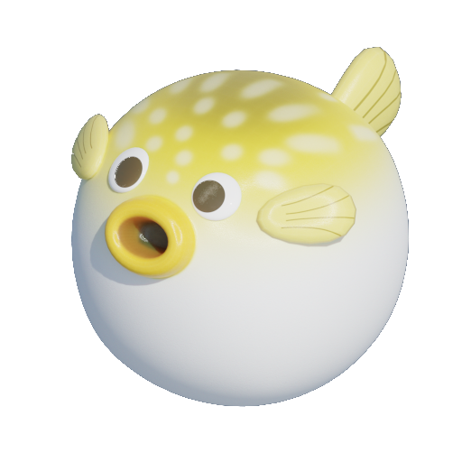

## 自己紹介

はじめまして、YukkiMoru です。  
IT 分野の幅広い領域に興味を持ち、**フロントエンド・バックエンド・インフラ・組込みシステム**など、さまざまな技術を学んでいます。  
**柔軟に対応できるエンジニア**を目指して、日々スキルアップに取り組んでいます。  
最近ではプログラミングに関するイベントに積極的に参加しています。

---

## 経歴・活動

### 2024 年

- **ICPC 2024 参加**
- [**MetaMe (NTT DOCOMO & 42TOKYO)**](projects\meta_hide_and_seek.md) - チーム開発でゲーム制作、優秀賞受賞
- [**サポーターズ マンスリーハッカソン**](projects/supporterz_hackathon.md)- Chrome 拡張機能開発、就活マッチング SNS

### 2025 年

- **自動運転 AI チャレンジ 2025** - 自動運転技術に関する大会に参加

---

## 技術スタック

詳しい技術スタックについては、[skill.md](skills.md)をご覧ください。

---

## 今後の目標

IT 分野全般に柔軟に対応できるエンジニアを目指し、幅広い領域のスキルを日々研鑽していきたいと考えています。

---

## 連絡先

- **GitHub**: [YukkiMoru](https://github.com/YukkiMoru)

---
