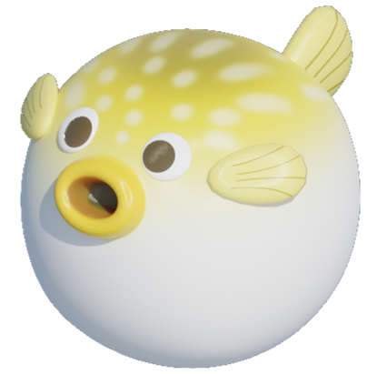
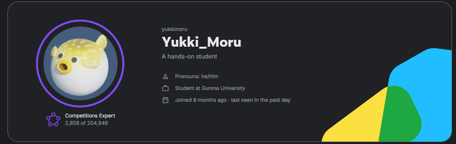
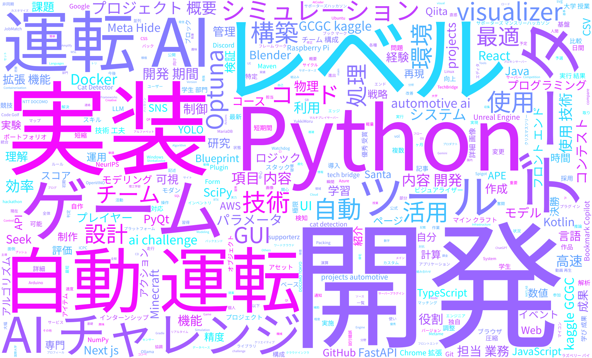

## 自己紹介

はじめまして、YukkiMoru です。  
理工学部で情報系分野を中心に学ぶ学生エンジニアです。
**自動運転・シミュレーション・組込み・AI・Web**まで、幅広い技術領域に関心を持ち、積極的に手を動かしてきました。  

## ニュース (2026年5月更新)

Kaggle の[Expert](https://www.kaggle.com/yukkimoru)になりました!!!   
   

    

        
    

    
私の興味・関心を表すキーワード群

---

## 活動実績

2026年

    <a href="projects/kaggle/Santa2025" class="card" style="background-image: url('assets/kaggle/Santa2025/visualizer_compare.png');">
        

            <h4>Santa 2025</h4>
            <strong>2次元パッキング問題</strong>
        

        

            Kaggle
            Python
            C++
            JavaScript
        

    </a>
    <a href="projects/kaggle/AIMO2026" class="card" style="background-image: url('assets/kaggle/AIMO2026/AIMO2026.png');">
        

            <h4>AIMO</h4>
            <strong>AIによる数学オリンピック</strong>
            
🥉 銅メダル獲得

        

        

            Kaggle
            Python
            LLM
        

    </a>

2025年

    <a href="projects/automotive_ai_challenge/" class="card" style="background-image: url('assets/automotive_ai_challenge/2025_final_course.jpg');">
        

            <h4>自動運転 AI チャレンジ 2025</h4>
            
🏆 決勝進出

            
独自ツール開発とOptunaによる自動化

        

        

            Python
            Docker
            Optuna
        

    </a>
    <a href="projects/kaggle/GCGC2025" class="card" style="background-image: url('assets/kaggle/GCGC2025/visualizer_v2.png');">
        

            <h4>NeurIPS 2025</h4>
            <strong>Code Golf</strong>
            
🥈 銀メダル獲得

        

        

            Kaggle
            Python
            C++
            Qt
        

    </a>

2024年

    <a href="projects/meta_hide_and_seek/" class="card" style="background-image: url('assets/x_techbridge/metahideandseek.jpg');">
        

            <h4>Meta Hide and Seek</h4>
            
🏆 優秀賞 受賞 (X-TechBridge)

            
4人チーム開発（NTT DOCOMO & 42TOKYO）

        

        

            UE5
            Blueprint
            Blender
        

    </a>
    <a href="projects/supporterz_hackathon/" class="card" style="background-image: url('assets/supporterz/bookmark-copilot.png'); background-position: top center;">
        

            <h4>サポーターズ ハッカソン</h4>
            
Webサービス開発

            
<strong>Bookmark Copilot</strong>: Chrome拡張機能開発 
            <strong>JobMatch SNS</strong>: Next.js + FastAPI 開発

        

        

            TypeScript
            Next.js
            FastAPI
        

    </a>
    

        

            <h4>ICPC 2024</h4>
            
国内予選参加

            
国際大学対抗プログラミングコンテスト

        

        

            C++
            Algorithm
        

    

    <a href="skills/" class="more-skills-btn">詳細なスキルを見る →</a>

---

## 技術発信

技術ブログ（Qiita）にて、開発したツールの紹介や技術検証の記事を執筆しています。

    <a href="https://qiita.com/YukkiMoru/items/878f8e5e96b64d02853e" target="_blank" class="article-card">
        
2026年02月14日

        <h4 class="article-title">API課金なし！Ollama × RTX3070(8GB)で始めるShinkaEvolveコード自動進化</h4>
        

            Python
            LLM
            ollama
        

    </a>
    <a href="https://qiita.com/YukkiMoru/items/3628e78b23642a59890b" class="article-card">
        
2025年11月15日

        <h4 class="article-title">専門外の2人が挑んだ自動運転AIチャレンジ奮闘記</h4>
        

            自動運転AIチャレンジ
        

    </a>
    <a href="https://qiita.com/YukkiMoru/items/98acd3871c249f24697c" target="_blank" class="article-card">
        
2025年09月01日

        <h4 class="article-title">【自動運転AIチャレンジ2025】面倒なコースデータ作成を効率化！Python製CSVエディタの紹介</h4>
        

            Python
            CSV
            自動運転AIチャレンジ
        

    </a>

    <a href="https://qiita.com/YukkiMoru" target="_blank" class="more-skills-btn">Qiitaプロフィールを見る →</a>

---

## 連絡先

- **GitHub**: [YukkiMoru](https://github.com/YukkiMoru)
- **Google Form**: [Google form](https://docs.google.com/forms/d/e/1FAIpQLSduIKKiZJ4HifRy8F0FaVCiF55lAkufoljYsCqQlqxcH2iouA/viewform)

    

        
    

    
本サイトのQRコード

