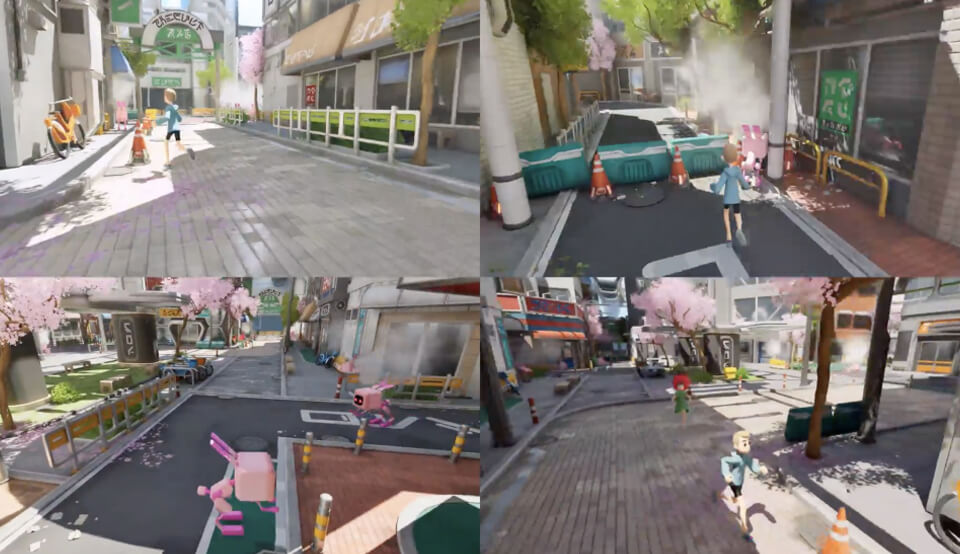

# Projects

## Meta Hide and Seek (X-tech Bridge)

NTT DOCOMOと42TOKYO主催の「MetaMe」内、X-Tech-Bridgeチーム開発イベントに参加し、「鬼ごっこ×かくれんぼ」をコンセプトにしたミニゲーム「Meta Hide and Seek」を開発しました。  
**開発期間：** 約3ヶ月  
**開発環境：** Unreal Engine, VSCode  
**使用技術：** Unreal Engine, Blender

4人チームで、既存のコミュニケーションプラットフォームに実装するかくれんぼゲームを制作。  
人間陣営3人と鬼1人に分かれ、人間はAIの解放、鬼は人間の捕獲を目指します。NPCに見つからないようにオブジェクトに擬態する機能なども実装しました。

**担当箇所：**  
- ゲーム全体の変数管理  
- プレイヤー機能の基盤実装  
- エフェクト制作  
- Blenderによる3Dモデリング

バージョン管理システムでのコンフリクトを避けるため、担当範囲を明確に分担し、密に連携しました。  
開発したゲームはイベント内で高く評価され、**優秀賞**を受賞しました。  
チーム開発や他参加者との交流を通じて多くの学びがありました。

詳細・画像: [MetaMe公式ページ](https://42tokyo.jp/landing/x-tech_bridge/2023/)  
※ X-tech-bridge様のウェブサイトより2025/5/6引用

詳細: [MetaMe公式ページ](https://42tokyo.jp/landing/x-tech_bridge/)

## サポーターズ マンスリーハッカソン

### Bookmark Copilot (Chrome Extension)

**サポーターズ マンスリーハッカソン vol.15**  
**開発期間：** 9日間  
**開発環境：** VSCode  
**使用言語：** JavaScript, HTML, CSS, Python

3人グループでChrome拡張機能「Bookmark Copilot」（AIによる自動仕分け機能）を開発しました。  
主にJavaScriptでフロントエンドの実装やUIの改善を担当しました。  
チームメンバーと協力し、バックエンドもほぼ完成し、フロントエンドも十分に実装できました。

### 就活マッチング×ポートフォリオSNS

![JMandPF-SNS]
<video controls muted width="320" height="180">
  <source src="../video/JMandPF-SNS.mp4" type="video/mp4">
  お使いのブラウザは動画の再生に対応していません。
</video>

**サポーターズ マンスリーハッカソン vol.14**  
**開発期間：** 9日間  
**開発環境：** VSCode, AWS  
**使用言語：** JavaScript（Next.js）, HTML, CSS（shadcn, Tailwind CSS）, Python（FastAPI）, MariaDB

4人グループでプログラミングを活用したサービスを開発しました。

## Minecraft Plugin

### 7DaysToMine

<video controls>
  <source src="../video/7DaysToMine.mp4" type="video/mp4">
  お使いのブラウザは動画の再生に対応していません。
</video>

**開発環境：** IntelliJ IDEA  
**使用技術：** Kotlin, Maven

マインクラフトは、ブロックを配置して自由に世界を創造できる人気のサンドボックスゲームです。
このプロジェクトは、そのマインクラフトの機能を拡張するためのプラグイン（未完成）です。
プラグインを導入することで、ゲームに新しいルールやアイテム、遊び方などを追加できます。

※実装機能：GUIと特定のブロックしか掘れないピッケルを実装しています。

