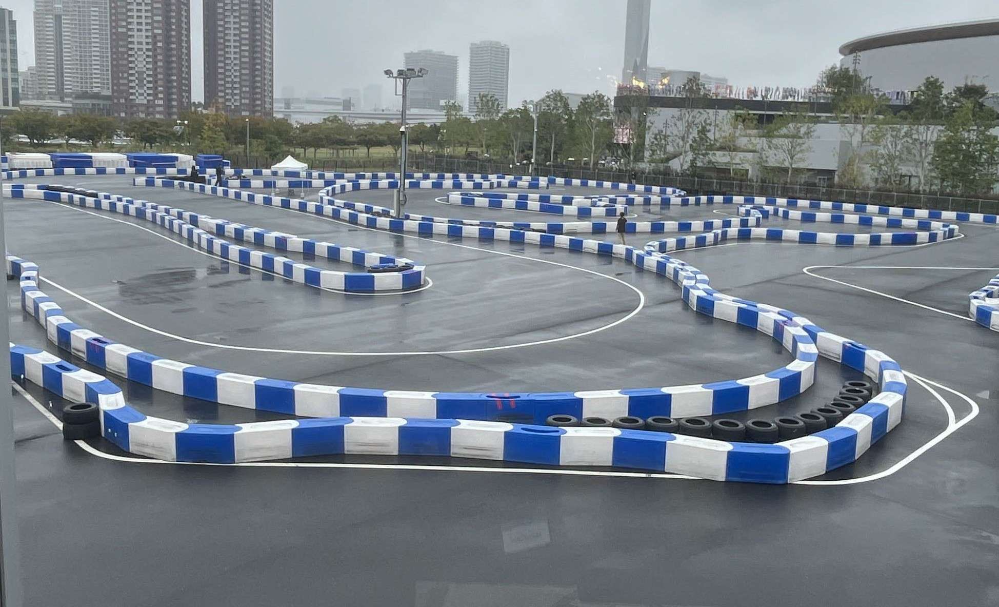

# 自動運転AIチャレンジ (シミュレーション、自動運転)

## データ活用と開発効率化で挑む、自動運転シミュレーション

<iframe width="560" height="315" src="https://www.youtube.com/embed/Mynxk4GBAzA?si=byioFGUdhC0WKqXL&autoplay=1&mute=1" title="YouTube video player" frameborder="0" allow="accelerometer; autoplay; clipboard-write; encrypted-media; gyroscope; picture-in-picture; web-share" referrerpolicy="strict-origin-when-cross-origin" allowfullscreen></iframe>

*決勝のコースの様子*

### プロジェクト概要

「[自動運転AIチャレンジ](https://www.jsae.or.jp/jaaic/2025ver/)」は、自動運転ソフトウェア「Autoware」を用いたシミュレーション競技です。
専門外の学生チーム2名で挑み、限られたリソースの中で最大限の成果を出す戦略を取りました。

| 項目 | 内容 |
| --- | --- |
| **開発期間** | 約3ヶ月 |
| **チーム構成** | 2名 |
| **使用技術** | Python (Optuna, SciPy, NumPy), Docker, Autoware |
| **役割** | ツール開発、シミュレーション基盤構築、パラメータ最適化 |
| **成果** | 予選：学生部門4位 / 決勝：学生部門5位 |

### 担当業務と技術的工夫

**1. 独自開発ツールによる作業効率化**
詳細なコースデータを効率的に作成するため、**Python製のGUIツール「[CSV Editor](https://qiita.com/YukkiMoru/items/98acd3871c249f24697c)」を自作**しました。
手作業でのデータ編集ミスを撲滅し、試行錯誤のサイクルを高速化しました。これはチームの「手数」を最大化するための重要な戦略でした。

**2. Dockerによる並列評価環境の構築**
シミュレーションの評価時間を短縮するため、Dockerコンテナを活用した並列実行環境を構築しました。
これにより、パラメータ変更ごとの検証時間を大幅に削減し、短期間で数多くの実験を行うことが可能になりました。

**3. Optunaを用いたパラメータ探索の自動化**
車両制御パラメータの調整において、手動調整だけでなく **Optuna (ベイズ最適化フレームワーク)** を導入しました。
感覚に頼らないデータドリブンなパラメータ決定を行い、安定した走行性能を実現しました。

**4. SciPyによる経路最適化**
コース取りの最適化には `SciPy` のスプライン補間を利用。滑らかでかつ最短に近い走行ラインを数学的に算出しました。

### 学び・成果
専門知識の不足を「開発力（ツール自作）」と「自動化（Optuna, Docker）」で補う戦略が奏功し、決勝進出を果たしました。
困難な課題に対しても、エンジニアリングのアプローチで解決策を見出す自信がつきました。

## 関連記事
本プロジェクトでの技術的挑戦をQiita記事として公開しています。

- [【自動運転AIチャレンジ2025】面倒なコースデータ作成を効率化！Python製CSVエディタの紹介](https://qiita.com/YukkiMoru/items/98acd3871c249f24697c)
- [専門外の2人が挑んだ自動運転AIチャレンジ奮闘記](https://qiita.com/YukkiMoru/items/3628e78b23642a59890b)

詳細・画像: [自動運転AIチャレンジ公式ページ](https://www.jsae.or.jp/jaaic/2025ver/)
