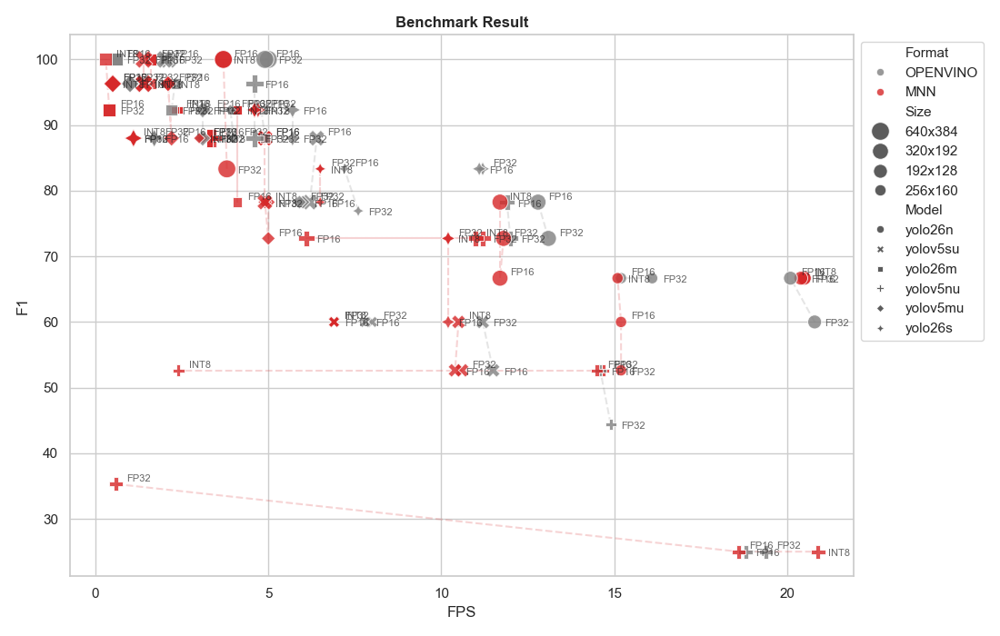

# Raspberry Pi Cat Detector (個人開発)

## 最新エッジAIとDiscordを統合した、リアルタイム猫見守りシステム

### プロジェクト概要

「猫が外から帰宅した瞬間を把握したい」という動機から開発した、プッシュ型通知システムです。
市販の監視カメラのような常時録画ではなく、最新のAIモデル（**YOLO26**）を用いることで「猫が活動した瞬間」のみを判定し、Discordへ即座に通知を送信します。

| 項目           | 内容                                                                      |
| -------------- | ------------------------------------------------------------------------- |
| **開発期間**   | 2026年1月3日 〜 現在（2026年3月）                                         |
| **開発構成**   | 個人開発                                                                  |
| **使用技術**   | Python (3.13), uv, OpenCV, Ultralytics YOLO26n, OpenVINO, Discord Webhook |
| **役割・実装** | システム設計、AIモデル選定・最適化                                        |

YOLO26は2026年1月にリリースされた最新のエッジ向けモデルです。低電力デバイスであるRaspberry Piにおいても、高精度かつ軽量な推論が可能であると考え、採用しました。

### 現時点でのシステム構成

### 精度実験（処理速度と精度のトレードオフ検証）

実運用に向け、YOLOデフォルトの.pt形式からの軽量化を図りました。MNNとOpenVINOを用いてそれぞれ量子化と解像度変更を行い、Raspberry Pi実機にて推論実験を実施しました。

_図1 ラズベリーパイの実行結果_

図1はRaspberry Piでの実行結果です。

- **横軸（FPS）：** 1秒間に処理できる画像枚数（処理速度）
- **縦軸（F1スコア）：** 「猫を見逃さない（再現率）」と「誤検知しない（適合率）」のバランスを示す総合指標

※本実験は検証用データ約20枚を用いた初期検証段階の数値であり、実用化に向けてさらなるデータ拡充を予定しています。

### 今後の方針・課題

現在の課題として、夜間など光量の少ない環境下での「猫の検知漏れ（再現率の低下）」が挙げられます。今後は以下の施策により、モデルの精度向上を図ります。

- **データ拡張（Data Augmentation）の実施：** 悪条件下の学習データを増やすとともに、複数の画像を合成する「Mosaic（モザイク）データ拡張」などを活用し、より実践的でロバストなモデルへのファインチューニングを実施する予定です。

### リポジトリ

[Repository](https://github.com/YukkiMoru/cat_detection)
