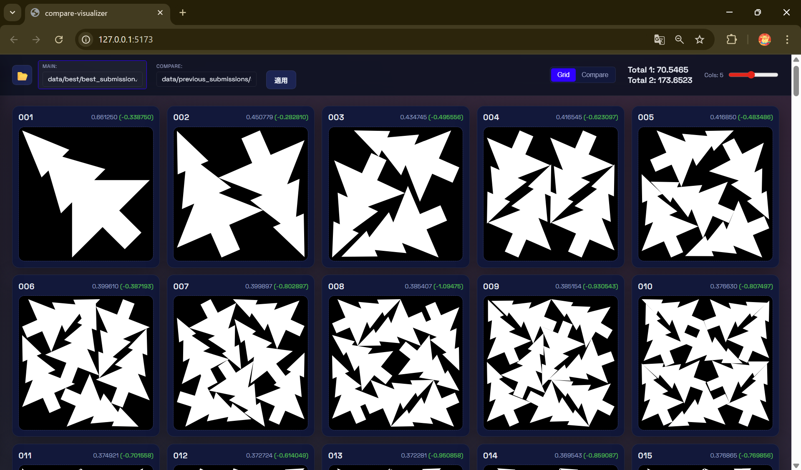

# Santa 2025 (Kaggle)

## 組合せ最適化：クリスマスツリーを最小の箱に詰め込む

### プロジェクト概要

一定の大きさのクリスマスツリーを、可能な限り小さな正方形に詰め込む「2次元パッキング問題」を解くコンテストです。物理演算と最適化アルゴリズムを駆使してスコアを競いました。

| 項目 | 内容 |
| --- | --- |
| **開発期間** | 2024年11月25日 〜 2025年1月31日 |
| **チーム構成** | 個人 |
| **使用技術** | Python (Optuna), C++, JavaScript (React, Vite) |
| **役割** | 可視化ツール開発、アルゴリズム実装・高速化 |
| **成果** | 827位 / 3357チーム |

### 担当業務と技術的工夫

**1. 物理ベース可視化ツールの開発**
- **PyQt6ベースのビジュアライザー**: オブジェクトの干渉や配置状況を3Dで可視化。
- **比較ビジュアライザー (compare-visualizer)**: 複数の解を並べて比較し、改善ポイントを直感的に発見できるように設計。

**2. アルゴリズムの実装と高速化**
- **C++による高速化**: 回転を含む物理シミュレーションのボトルネックとなっていた部分をC++で再実装し、Pythonから呼び出すことで計算時間を短縮。
- **Optunaによるパラメータ調整**: 物理シミュレーションのパラメータを自動チューニング
- **マージ戦略の設計**: 公開解法の「良いとこ取り」をするロジックを実装し、スコアの底上げを行いました。

### 学び・成果

可視化ツールを自作したことでアルゴリズムの挙動理解が深まりました。また、異種言語（PythonとC++）を連携させた高速化の実装経験が得られました。

### 関連リンク

- [Kaggle Santa2025 コンテストページ](https://www.kaggle.com/competitions/santa-2025)