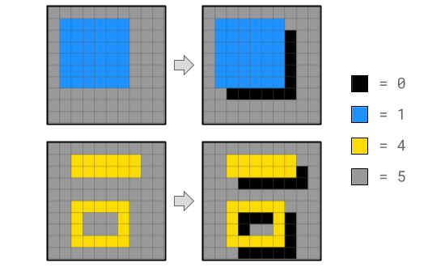
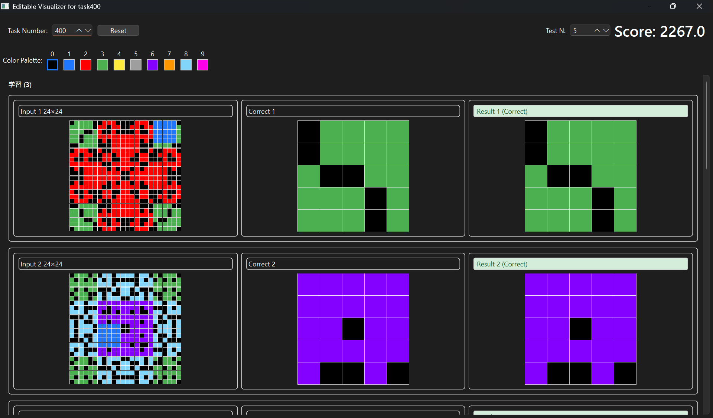
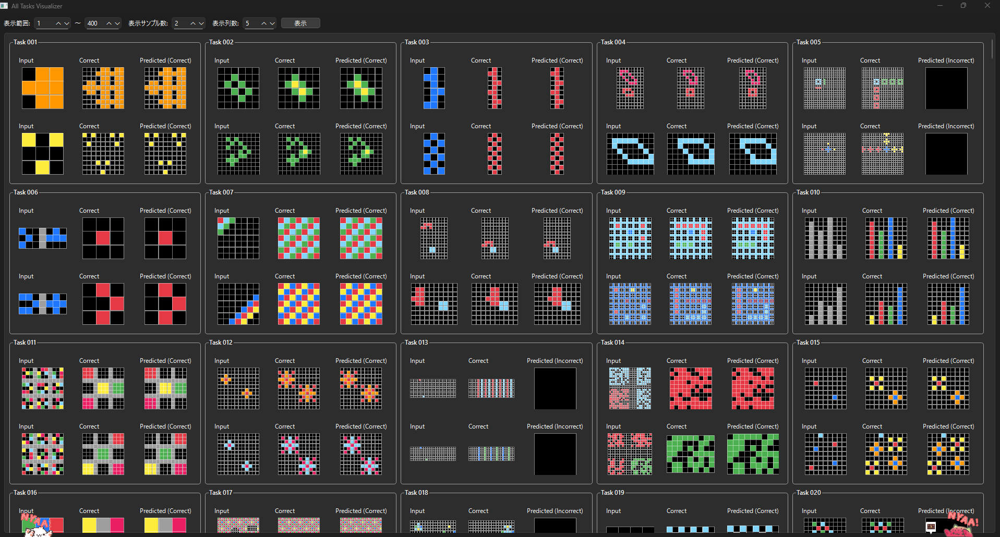

# NeurIPS 2025 - Google Code Golf Championship

## 少ない文字で問題を解く！

NeurIPS 2025のコンペティション部門としてKaggleで開催された、指定された課題を解決するPythonコードの「文字数（バイト数）」の少なさを競うコンテスト。単なる人力コードゴルフだけでなく、LLMを用いたコード生成や最適化が推奨され、AIと人間の協調による極限の圧縮が求められました。

**開発期間：** 2025年8月1日 〜 2025年10月31日  
**開発環境：** python(PyQt6, Watchdog)
**使用技術：** python(Standard Library,zlib/zopfli(圧縮)), AI/LLM関連, アルゴリズム(コードゴルフテクニック)  　　

*visualizer_v1のUI*

*visualizer_APE(All Preview Edition)のUI*

*visualizer_v2のUI*
**担当箇所：**

- ビジュアライザーの開発(visualizer_v1) 探索・デバッグ用 
<!-- ホットリロード機能の実装: watchdog ライブラリを用いて解答コードの変更を検知し、保存と同時に自動で再実行・可視化を行う環境を構築。 -->
- ビジュアライザーの開発(visualizer_APE) プレビュー用
- ビジュアライザーの開発(visualizer_v2) 非同期圧縮処理・UX向上 
 <!-- 非同期処理によるUX向上: 圧縮処理やスコア計算などの重い処理を QThread と Worker パターンを用いて別スレッド化。計算中もGUIがフリーズせず、快適な操作性を維持。  
 手動テストケース注入機能: コンテストの隠しテストケースを想定し、JSON経由で任意のエッジケースを動的に追加・検証できる機能を実装。 -->

「1秒の待ち時間」を削るための技術選定をしました。コードゴルフでは「書いては直し」の試行回数が勝敗を分けます。初期バージョンでは計算処理でGUIが固まることがありましたが、v2では QThread を導入してスコア計算をバックグラウンド化しました。Pythonプロセスを落とさずにロジックだけを差し替えるホットリロードを実現し、チーム全体の「最短コード実装→確認」のサイクルを極限まで短縮しました。

詳細・画像: [Kaggle GCGC2025 コンテストページ](https://www.kaggle.com/competitions/google-code-golf-2025)  
