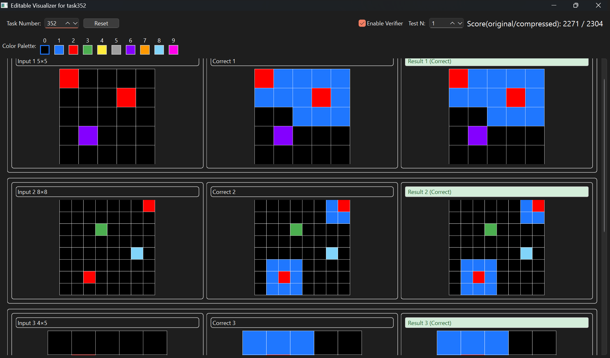
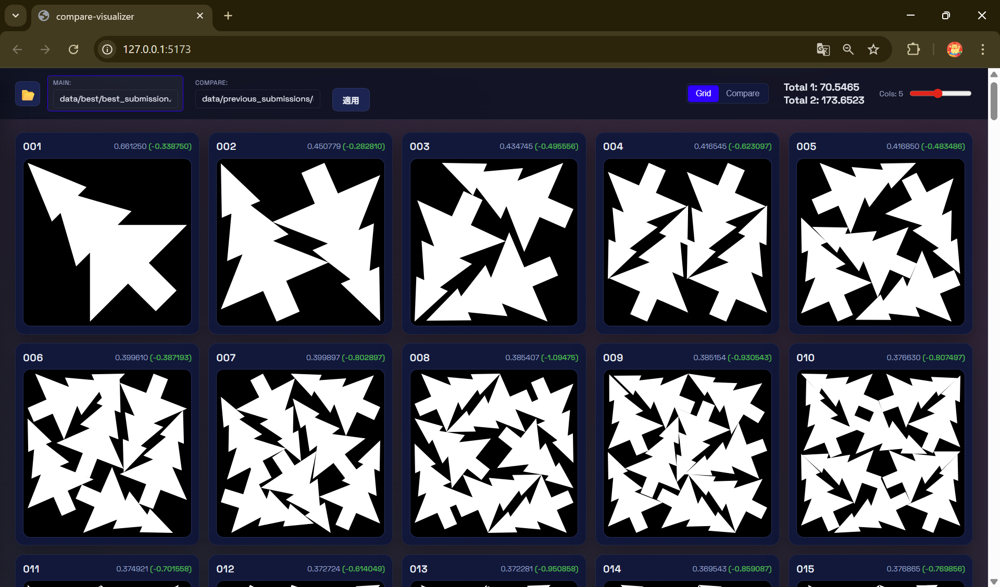

# NeurIPS 2025 - Google Code Golf Championship

## AIと協調して極限のコード圧縮に挑む

NeurIPS 2025のコンペティション部門としてKaggleで開催された、指定された課題を解決するPythonコードの「文字数（バイト数）」の少なさを競うコンテストです。
単なるコードゴルフではなく、LLMを用いたコード生成や最適化、AIと人間の協調による極限の圧縮が求められました。

### プロジェクト概要

| 項目 | 内容 |
| --- | --- |
| **開発期間** | 2025年8月1日 〜 2025年10月31日 |
| **開発人数** | 4人 |
| **使用技術** | Python (PyQt6, Watchdog, zlib/zopfli), AI/LLM, アルゴリズム |
| **役割** | ツール開発リード、可視化エンジニア |

### 担当業務と技術的工夫

**1. 高速な試行錯誤を支えるビジュアライザー (visualizer_v1, visualizer_APE)**
ビジュアライザの「1秒の待ち時間」を削るため、以下の機能を実装しました。
- **ホットリロード機能**: `watchdog` ライブラリで解答コードの変更を検知し、保存と同時に自動で再実行・可視化。
- **プレビュー機能 (APE)**: 複数の問題を一覧表示し、比較検討を容易に。

*visualizer_v1のUI*

*visualizer_APE(All Preview Edition)のUI*

**2. UX向上と非同期処理の実装 (visualizer_v2)**
初期バージョンでは重い計算処理でGUIがフリーズする課題がありました。
- **非同期処理の導入**: `QThread` と Worker パターンを用いて圧縮処理やスコア計算をバックグラウンド化。GUIのレスポンスを維持しました。

*visualizer_v2のUI*

### 成果
チーム全体の「最短コード実装→確認」のサイクルを極限まで短縮し、開発効率を大幅に向上させました。

詳細・画像: [Kaggle GCGC2025 コンテストページ](https://www.kaggle.com/competitions/google-code-golf-2025)

---

# Santa 2025 - Christmas Tree Packing Challenge

## 組合せ最適化：クリスマスツリーを最小の箱に詰め込む

### コンテスト概要
一定の大きさのクリスマスツリーを、可能な限り小さな正方形に詰め込む「2次元パッキング問題」を解くコンテストです。物理演算と最適化アルゴリズムを駆使してスコアを競いました。

### プロジェクト概要

| 項目 | 内容 |
| --- | --- |
| **開発期間** | 2024年11月25日 〜 2025年1月31日 |
| **使用技術** | Python (Optuna), C++, JavaScript (React, Vite) |
| **手法** | 焼きなまし法 (Simulated Annealing), 物理シミュレーション |

### 担当業務と技術的工夫

**1. 物理ベース可視化ツールの開発**
- **PyQt6ベースのビジュアライザー**: オブジェクトの干渉や配置状況を3Dで可視化。
- **比較ビジュアライザー (compare-visualizer)**: 複数の解を並べて比較し、改善ポイントを直感的に発見できるように設計。

**2. アルゴリズムの実装と高速化**
- **C++による高速化**: 回転を含む物理シミュレーションのボトルネックとなっていた部分をC++で再実装し、Pythonから呼び出すことで計算時間を短縮。
- **Optunaによるパラメータ調整**: 物理シミュレーションのパラメータを自動チューニング
- **マージ戦略の設計**: 公開解法の「良いとこ取り」をするロジックを実装し、スコアの底上げを行いました。

### 学び・成果
可視化ツールを自作したことでアルゴリズムの挙動理解が深まりました。また、異種言語（PythonとC++）を連携させた高速化の実装経験が得られました。

詳細・画像: [Kaggle Santa2025 コンテストページ](https://www.kaggle.com/competitions/santa-2025)
  