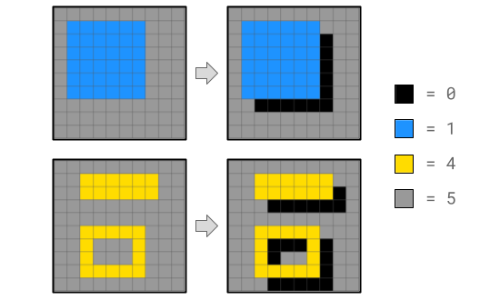
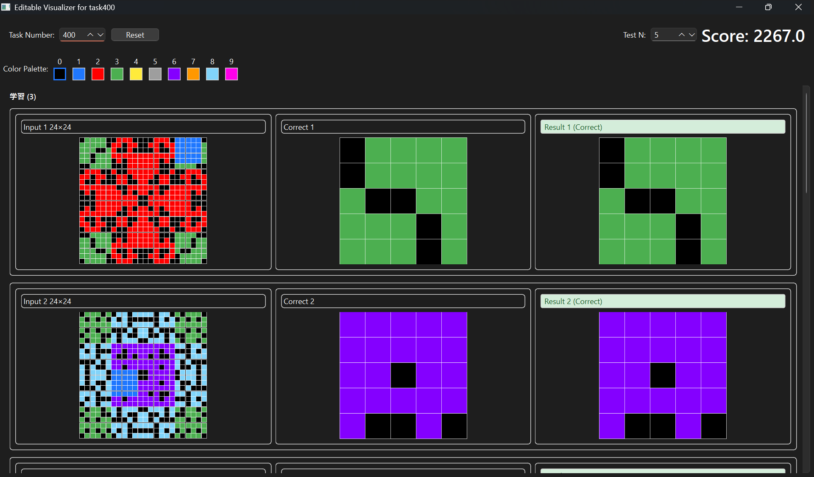
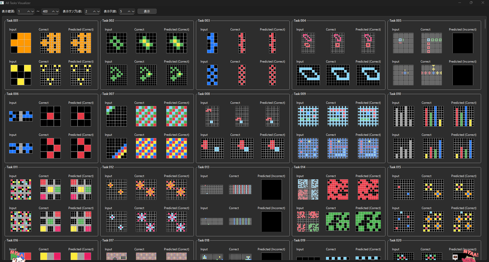
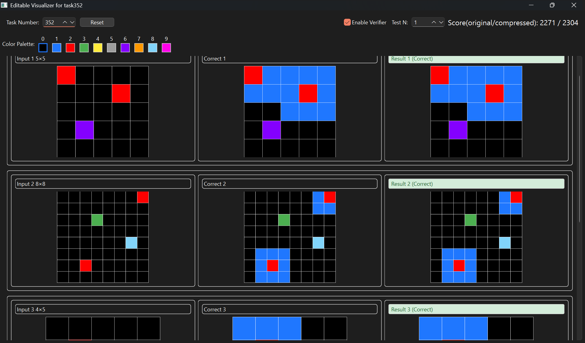

# NeurIPS 2025 - Google Code Golf Championship

## AIと協調して極限のコード圧縮に挑む

NeurIPS 2025のコンペティション部門としてKaggleで開催された、指定された課題を解決するPythonコードの「文字数（バイト数）」の少なさを競うコンテストです。
単なるコードゴルフではなく、LLMを用いたコード生成や最適化、AIと人間の協調による極限の圧縮が求められました。

### プロジェクト概要

| 項目 | 内容 |
| --- | --- |
| **開発期間** | 2025年8月1日 〜 2025年10月31日 |
| **最終成績** | 53位 / 1,142 チーム (上位4.6%・銀メダル獲得🥈) |
| **開発人数** | 4人 |
| **使用技術** | Python (PyQt6, Watchdog, zlib/zopfli), LLM(API), アルゴリズム |
| **役割** | ツール開発リード、可視化エンジニア |

### 担当業務と技術的工夫

**1. 高速な試行錯誤を支えるビジュアライザー (visualizer_v1, visualizer_APE)**
ビジュアライザの「1秒の待ち時間」を削るため、以下の機能を実装しました。
- **ホットリロード機能**: `watchdog` ライブラリで解答コードの変更を検知し、保存と同時に自動で再実行・可視化。
- **プレビュー機能 (APE)**: 複数の問題を一覧表示し、比較検討を容易に。

*visualizer_v1のUI*

*visualizer_APE(All Preview Edition)のUI*

**2. UX向上と非同期処理の実装 (visualizer_v2)**
初期バージョンでは重い計算処理でGUIがフリーズする課題がありました。
- **非同期処理の導入**: `QThread` と Worker パターンを用いて圧縮処理やスコア計算をバックグラウンド化。GUIのレスポンスを維持しました。

*visualizer_v2のUI*

### 成果
チーム全体の「最短コード実装→確認」のサイクルを極限まで短縮し、開発効率を大幅に向上させました。

詳細・画像: [Kaggle GCGC2025 コンテストページ](https://www.kaggle.com/competitions/google-code-golf-2025)

---
