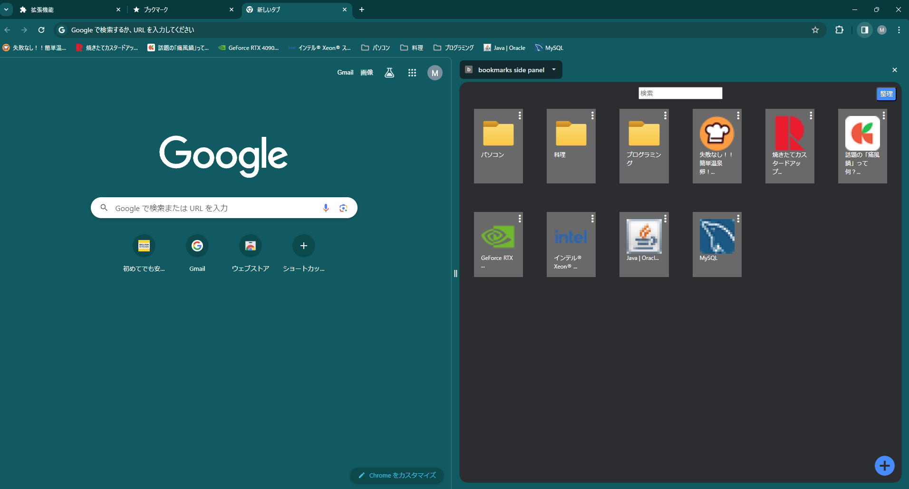

# サポーターズ マンスリーハッカソン

## Bookmark Copilot (Chrome拡張機能)

**サポーターズ マンスリーハッカソン vol.15**  
**開発期間：** 9 日間  
**開発環境：** VSCode  
**使用言語：** JavaScript, HTML, CSS, Python

3 人グループで Chrome 拡張機能「Bookmark Copilot」（AI による自動仕分け機能）を開発しました。  
主に JavaScript でフロントエンドの実装や UI の改善を担当しました。  
チームメンバーと協力し、バックエンドとフロントエンドも十分に実装できました。

## 就活マッチング × ポートフォリオ SNS (ウェブサイト)

<video controls muted >

  <source src="../../video/JMandPF-SNS.mp4" type="video/mp4">
  お使いのブラウザは動画の再生に対応していません。
</video>

**サポーターズ マンスリーハッカソン vol.14**  
**開発期間：** 9 日間  
**開発環境：** VSCode, AWS  
**使用言語：** JavaScript（Next.js）, HTML, CSS（shadcn, Tailwind CSS）, Python（FastAPI）, MariaDB

4 人グループでプログラミングを活用したサービスを開発しました。
