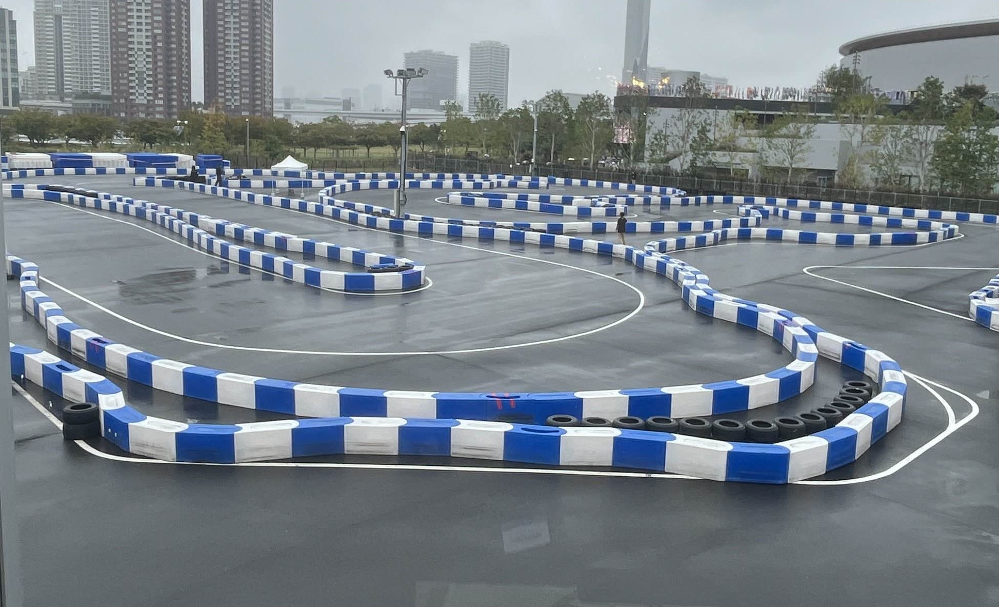
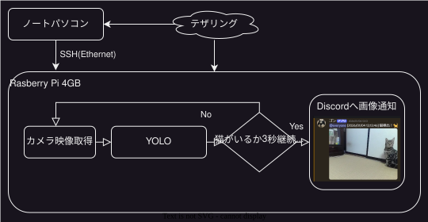
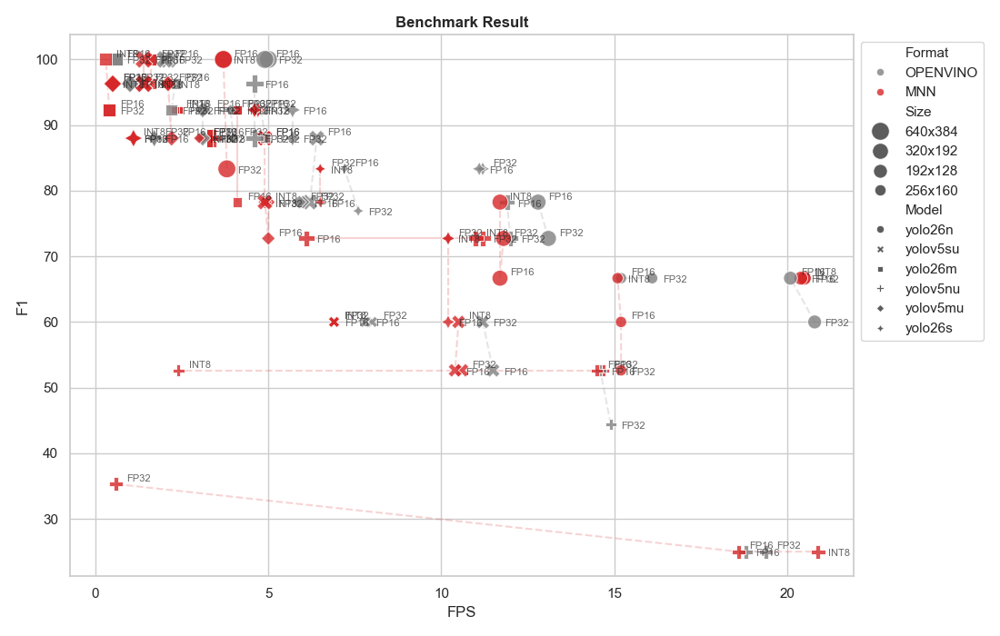
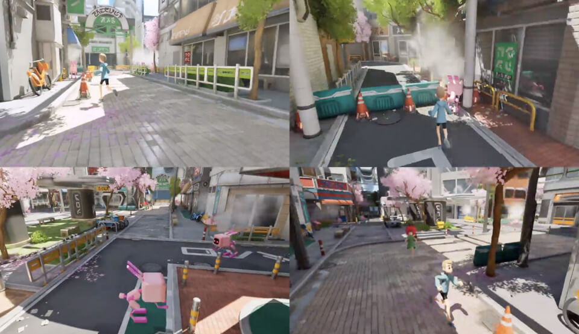
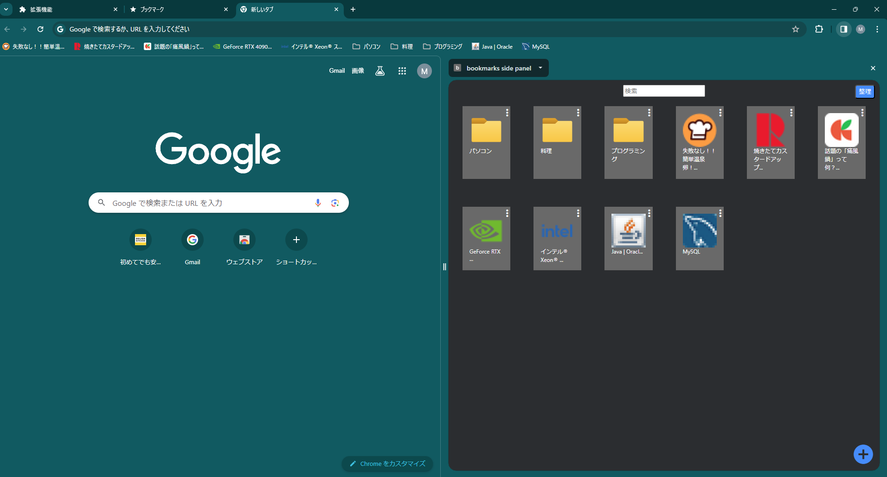

<!-- SOURCE: index.md -->
# File: index.md

## 自己紹介

はじめまして、YukkiMoru です。  
理工学部で情報系分野を中心に学ぶ学生エンジニアです。
**自動運転・シミュレーション・組込み・AI・Web**まで、幅広い技術領域に関心を持ち、積極的に手を動かしてきました。  

## ニュース (2026年5月更新)

Kaggle の[Expert](https://www.kaggle.com/yukkimoru)になりました!!!   
   

    

        
    

    
私の興味・関心を表すキーワード群

---

## 活動実績

2026年

    <a href="projects/kaggle/Santa2025" class="card" style="background-image: url('assets/kaggle/Santa2025/visualizer_compare.png');">
        

            <h4>Santa 2025</h4>
            <strong>2次元パッキング問題</strong>
        

        

            Kaggle
            Python
            C++
            JavaScript
        

    </a>
    <a href="projects/kaggle/AIMO2026" class="card" style="background-image: url('assets/kaggle/AIMO2026/AIMO2026.png');">
        

            <h4>AIMO</h4>
            <strong>AIによる数学オリンピック</strong>
            
🥉 銅メダル獲得

        

        

            Kaggle
            Python
            LLM
        

    </a>

2025年

    <a href="projects/automotive_ai_challenge/" class="card" style="background-image: url('assets/automotive_ai_challenge/2025_final_course.jpg');">
        

            <h4>自動運転 AI チャレンジ 2025</h4>
            
🏆 決勝進出

            
独自ツール開発とOptunaによる自動化

        

        

            Python
            Docker
            Optuna
        

    </a>
    <a href="projects/kaggle/GCGC2025" class="card" style="background-image: url('assets/kaggle/GCGC2025/visualizer_v2.png');">
        

            <h4>NeurIPS 2025</h4>
            <strong>Code Golf</strong>
            
🥈 銀メダル獲得

        

        

            Kaggle
            Python
            C++
            Qt
        

    </a>

2024年

    <a href="projects/meta_hide_and_seek/" class="card" style="background-image: url('assets/x_techbridge/metahideandseek.jpg');">
        

            <h4>Meta Hide and Seek</h4>
            
🏆 優秀賞 受賞 (X-TechBridge)

            
4人チーム開発（NTT DOCOMO & 42TOKYO）

        

        

            UE5
            Blueprint
            Blender
        

    </a>
    <a href="projects/supporterz_hackathon/" class="card" style="background-image: url('assets/supporterz/bookmark-copilot.png'); background-position: top center;">
        

            <h4>サポーターズ ハッカソン</h4>
            
Webサービス開発

            
<strong>Bookmark Copilot</strong>: Chrome拡張機能開発 
            <strong>JobMatch SNS</strong>: Next.js + FastAPI 開発

        

        

            TypeScript
            Next.js
            FastAPI
        

    </a>
    

        

            <h4>ICPC 2024</h4>
            
国内予選参加

            
国際大学対抗プログラミングコンテスト

        

        

            C++
            Algorithm
        

    

    <a href="skills/" class="more-skills-btn">詳細なスキルを見る →</a>

---

## 技術発信

技術ブログ（Qiita）にて、開発したツールの紹介や技術検証の記事を執筆しています。

    <a href="https://qiita.com/YukkiMoru/items/878f8e5e96b64d02853e" target="_blank" class="article-card">
        
2026年02月14日

        <h4 class="article-title">API課金なし！Ollama × RTX3070(8GB)で始めるShinkaEvolveコード自動進化</h4>
        

            Python
            LLM
            ollama
        

    </a>
    <a href="https://qiita.com/YukkiMoru/items/3628e78b23642a59890b" class="article-card">
        
2025年11月15日

        <h4 class="article-title">専門外の2人が挑んだ自動運転AIチャレンジ奮闘記</h4>
        

            自動運転AIチャレンジ
        

    </a>
    <a href="https://qiita.com/YukkiMoru/items/98acd3871c249f24697c" target="_blank" class="article-card">
        
2025年09月01日

        <h4 class="article-title">【自動運転AIチャレンジ2025】面倒なコースデータ作成を効率化！Python製CSVエディタの紹介</h4>
        

            Python
            CSV
            自動運転AIチャレンジ
        

    </a>

    <a href="https://qiita.com/YukkiMoru" target="_blank" class="more-skills-btn">Qiitaプロフィールを見る →</a>

---

## 連絡先

- **GitHub**: [YukkiMoru](https://github.com/YukkiMoru)
- **Google Form**: [Google form](https://docs.google.com/forms/d/e/1FAIpQLSduIKKiZJ4HifRy8F0FaVCiF55lAkufoljYsCqQlqxcH2iouA/viewform)

    

        
    

    
本サイトのQRコード

---

<!-- SOURCE: projects\automotive_ai_challenge.md -->
# File: projects\automotive_ai_challenge.md

# 自動運転AIチャレンジ (シミュレーション、自動運転)

## データ活用と開発効率化で挑む、自動運転シミュレーション

<iframe width="560" height="315" src="https://www.youtube.com/embed/Mynxk4GBAzA?si=byioFGUdhC0WKqXL" title="YouTube video player" frameborder="0" allow="accelerometer; autoplay; clipboard-write; encrypted-media; gyroscope; picture-in-picture; web-share" referrerpolicy="strict-origin-when-cross-origin" allowfullscreen></iframe>

*決勝のコースの様子*

### プロジェクト概要

「[自動運転AIチャレンジ](https://www.jsae.or.jp/jaaic/2025ver/)」は、自動運転ソフトウェア「Autoware」を用いたシミュレーション競技です。
専門外の学生チーム2名で挑み、限られたリソースの中で最大限の成果を出す戦略を取りました。

| 項目 | 内容 |
| --- | --- |
| **開発期間** | 約3ヶ月 |
| **チーム構成** | 2名 |
| **使用技術** | Python (Optuna, SciPy, NumPy), Docker, Autoware |
| **役割** | ツール開発、シミュレーション基盤構築、パラメータ最適化 |
| **成果** | 予選：学生部門4位 / 決勝：学生部門5位 |

### 担当業務と技術的工夫

**1. 独自開発ツールによる作業効率化**
詳細なコースデータを効率的に作成するため、**Python製のGUIツール「[CSV Editor](https://qiita.com/YukkiMoru/items/98acd3871c249f24697c)」を自作**しました。
手作業でのデータ編集ミスを撲滅し、試行錯誤のサイクルを高速化しました。これはチームの「手数」を最大化するための重要な戦略でした。

**2. Dockerによる並列評価環境の構築**
シミュレーションの評価時間を短縮するため、Dockerコンテナを活用した並列実行環境を構築しました。
これにより、パラメータ変更ごとの検証時間を大幅に削減し、短期間で数多くの実験を行うことが可能になりました。

**3. Optunaを用いたパラメータ探索の自動化**
車両制御パラメータの調整において、手動調整だけでなく **Optuna (ベイズ最適化フレームワーク)** を導入しました。
感覚に頼らないデータドリブンなパラメータ決定を行い、安定した走行性能を実現しました。

**4. SciPyによる経路最適化**
コース取りの最適化には `SciPy` のスプライン補間を利用。滑らかでかつ最短に近い走行ラインを数学的に算出しました。

### 学び・成果
専門知識の不足を「開発力（ツール自作）」と「自動化（Optuna, Docker）」で補う戦略が奏功し、決勝進出を果たしました。
困難な課題に対しても、エンジニアリングのアプローチで解決策を見出す自信がつきました。

## 関連記事
本プロジェクトでの技術的挑戦をQiita記事として公開しています。

- [【自動運転AIチャレンジ2025】面倒なコースデータ作成を効率化！Python製CSVエディタの紹介](https://qiita.com/YukkiMoru/items/98acd3871c249f24697c)
- [専門外の2人が挑んだ自動運転AIチャレンジ奮闘記](https://qiita.com/YukkiMoru/items/3628e78b23642a59890b)

詳細・画像: [自動運転AIチャレンジ公式ページ](https://www.jsae.or.jp/jaaic/2025ver/)

---

<!-- SOURCE: projects\cat_detection.md -->
# File: projects\cat_detection.md

# Raspberry Pi Cat Detector (個人開発)

## 最新エッジAIとDiscordを統合した、リアルタイム猫見守りシステム

### プロジェクト概要

「猫が外から帰宅した瞬間を把握したい」という動機から開発した、プッシュ型通知システムです。
市販の監視カメラのような常時録画ではなく、最新のAIモデル（**YOLO26**）を用いることで「猫が活動した瞬間」のみを判定し、Discordへ即座に通知を送信します。

| 項目           | 内容                                                                      |
| -------------- | ------------------------------------------------------------------------- |
| **開発期間**   | 2026年1月3日 〜 現在（2026年3月）                                         |
| **開発構成**   | 個人開発                                                                  |
| **使用技術**   | Python (3.13), uv, OpenCV, Ultralytics YOLO26n, OpenVINO, Discord Webhook |
| **役割・実装** | システム設計、AIモデル選定・最適化                                        |

YOLO26は2026年1月にリリースされた最新のエッジ向けモデルです。低電力デバイスであるRaspberry Piにおいても、高精度かつ軽量な推論が可能であると考え、採用しました。

### 現時点でのシステム構成

### 精度実験（処理速度と精度のトレードオフ検証）

実運用に向け、YOLOデフォルトの.pt形式からの軽量化を図りました。MNNとOpenVINOを用いてそれぞれ量子化と解像度変更を行い、Raspberry Pi実機にて推論実験を実施しました。

_図1 ラズベリーパイの実行結果_

図1はRaspberry Piでの実行結果です。

- **横軸（FPS）：** 1秒間に処理できる画像枚数（処理速度）
- **縦軸（F1スコア）：** 「猫を見逃さない（再現率）」と「誤検知しない（適合率）」のバランスを示す総合指標

※本実験は検証用データ約20枚を用いた初期検証段階の数値であり、実用化に向けてさらなるデータ拡充を予定しています。

### 今後の方針・課題

現在の課題として、夜間など光量の少ない環境下での「猫の検知漏れ（再現率の低下）」が挙げられます。今後は以下の施策により、モデルの精度向上を図ります。

- **データ拡張（Data Augmentation）の実施：** 悪条件下の学習データを増やすとともに、複数の画像を合成する「Mosaic（モザイク）データ拡張」などを活用し、より実践的でロバストなモデルへのファインチューニングを実施する予定です。

### リポジトリ

[Repository](https://github.com/YukkiMoru/cat_detection)

---

<!-- SOURCE: projects\kaggle\AIMO2026.md -->
# File: projects\kaggle\AIMO2026.md

# AI Mathematical Olympiad - Progress Prize 3

## オープンソースLLMを用いた国際数学オリンピックレベルの難問への挑戦

### コンテスト概要
AIモデルの数学的推論能力を競うコンペティションです。代数、組合せ数学、幾何学、数論にわたる110問の完全新規の数学問題を、オープンソースのLLMを用いて解き、その正答数を競いました。解答は0〜99999の整数に限定されており、厳密な数式処理と推論が求められます。

### プロジェクト概要

| 項目 | 内容 |
| --- | --- |
| **開発期間** | 2025年11月21日 〜 2026年4月16日 |
| **最終成績** | 330位 / 4138チーム (上位8%・銅メダル獲得🥉) |
| **開発人数** | 1人 |
| **使用技術** | Python, オープンソースLLM(GPT-OSS-120b)|
| **手法** | プロンプトエンジニアリング |

### 学び・成果
AI Mathematical Olympiad - Progress Prize 3(AIMO3)では、1日1回という提出回数の制限がありました。この枠を最大限に生かすため、毎日欠かさず提出とスコアの検証を繰り返しました。

詳細・画像: [Kaggle AIMO コンテストページ](https://www.kaggle.com/competitions/ai-mathematical-olympiad-progress-prize-3)

---

---

<!-- SOURCE: projects\kaggle\GCGC2025.md -->
# File: projects\kaggle\GCGC2025.md

# NeurIPS 2025 - Google Code Golf Championship

## AIと協調して極限のコード圧縮に挑む

NeurIPS 2025のコンペティション部門としてKaggleで開催された、指定された課題を解決するPythonコードの「文字数（バイト数）」の少なさを競うコンテストです。
単なるコードゴルフではなく、LLMを用いたコード生成や最適化、AIと人間の協調による極限の圧縮が求められました。

### プロジェクト概要

| 項目 | 内容 |
| --- | --- |
| **開発期間** | 2025年8月1日 〜 2025年10月31日 |
| **最終成績** | 53位 / 1,142 チーム (上位4.6%・銀メダル獲得🥈) |
| **開発人数** | 4人 |
| **使用技術** | Python (PyQt6, Watchdog, zlib/zopfli), LLM(API), アルゴリズム |
| **役割** | ツール開発リード、可視化エンジニア |

### 担当業務と技術的工夫

**1. 高速な試行錯誤を支えるビジュアライザー (visualizer_v1, visualizer_APE)**
ビジュアライザの「1秒の待ち時間」を削るため、以下の機能を実装しました。
- **ホットリロード機能**: `watchdog` ライブラリで解答コードの変更を検知し、保存と同時に自動で再実行・可視化。
- **プレビュー機能 (APE)**: 複数の問題を一覧表示し、比較検討を容易に。

*visualizer_v1のUI*

*visualizer_APE(All Preview Edition)のUI*

**2. UX向上と非同期処理の実装 (visualizer_v2)**
初期バージョンでは重い計算処理でGUIがフリーズする課題がありました。
- **非同期処理の導入**: `QThread` と Worker パターンを用いて圧縮処理やスコア計算をバックグラウンド化。GUIのレスポンスを維持しました。

*visualizer_v2のUI*

### 成果
チーム全体の「最短コード実装→確認」のサイクルを極限まで短縮し、開発効率を大幅に向上させました。

詳細・画像: [Kaggle GCGC2025 コンテストページ](https://www.kaggle.com/competitions/google-code-golf-2025)

---

---

<!-- SOURCE: projects\kaggle\Santa2025.md -->
# File: projects\kaggle\Santa2025.md

# Santa 2025 - Christmas Tree Packing Challenge

## 組合せ最適化：クリスマスツリーを最小の箱に詰め込む

### コンテスト概要
一定の大きさのクリスマスツリーを、可能な限り小さな正方形に詰め込む「2次元パッキング問題」を解くコンテストです。物理演算と最適化アルゴリズムを駆使してスコアを競いました。

### プロジェクト概要

| 項目 | 内容 |
| --- | --- |
| **開発期間** | 2024年11月25日 〜 2025年1月31日 |
| **最終成績** | 827位 / 3357チーム |
| **使用技術** | Python (Optuna), C++, JavaScript (React, Vite) |
| **手法** | 焼きなまし法 (Simulated Annealing), 物理シミュレーション |

### 担当業務と技術的工夫

**1. 物理ベース可視化ツールの開発**
- **PyQt6ベースのビジュアライザー**: オブジェクトの干渉や配置状況を3Dで可視化。
- **比較ビジュアライザー (compare-visualizer)**: 複数の解を並べて比較し、改善ポイントを直感的に発見できるように設計。

**2. アルゴリズムの実装と高速化**
- **C++による高速化**: 回転を含む物理シミュレーションのボトルネックとなっていた部分をC++で再実装し、Pythonから呼び出すことで計算時間を短縮。
- **Optunaによるパラメータ調整**: 物理シミュレーションのパラメータを自動チューニング
- **マージ戦略の設計**: 公開解法の「良いとこ取り」をするロジックを実装し、スコアの底上げを行いました。

### 学び・成果
可視化ツールを自作したことでアルゴリズムの挙動理解が深まりました。また、異種言語（PythonとC++）を連携させた高速化の実装経験が得られました。

詳細・画像: [Kaggle Santa2025 コンテストページ](https://www.kaggle.com/competitions/santa-2025)

---

<!-- SOURCE: projects\meta_hide_and_seek.md -->
# File: projects\meta_hide_and_seek.md

# Meta Hide and Seek (3Dゲーム開発)

## 「鬼ごっこ × かくれんぼ」優秀賞受賞作品

### プロジェクト概要

NTT DOCOMO と 42TOKYO が主催するイベントで開発した、Web上でプレイできる Metaverse プラットフォーム「Metame」向けのミニゲームです。
人間陣営（3人）が鬼（1人）から逃げながらAIを解放する、非対称対戦型のアクションゲームです。

| 項目 | 内容 |
| --- | --- |
| **開発期間** | 約3ヶ月 |
| **チーム構成** | 4名 |
| **使用技術** | Unreal Engine (Blueprint), Blender, JavaScript |
| **役割** | ゲームロジック設計、プレイヤー制御基盤、3Dモデリング |
| **成果** | イベントにて **優秀賞** を受賞 |

### 担当業務と技術的工夫

**1. ゲームロジックとプレイヤー制御の実装**
- **状態管理 (State Management)**: ゲーム全体の進行状況（各プレイヤーの状態、残り時間、勝敗判定など）を管理する基盤システムを構築しました。
- **プレイヤーアクション**: 移動、擬態（オブジェクトに変身）、インタラクションといったコアとなるアクション機能をUnreal Engineのブループリントで実装しました。

**2. 3Dアセット制作 (Blender)**
- キャラクターやマップ上のオブジェクトのモデリングを担当。最適化を意識し、ポリゴン数を抑えつつ見栄えの良いモデルを作成しました。

**3. チーム開発におけるバージョン管理**
- 4人チームでの同時並行開発において、バイナリファイルが多いゲーム開発特有のコンフリクト問題を回避するため、Git運用ルールを策定しました。
- 各メンバーの作業範囲（マップエリア、機能モジュール）を明確に分割し、スムーズな統合を実現しました。

### 学び・成果
大規模なゲームエンジンの使用経験に加え、チーム開発におけるコミュニケーションと設計共有の重要性を深く学びました。
優秀賞という結果は、技術力とチームワークの結晶だと自負しています。

詳細・画像: [MetaMe 公式ページ](https://42tokyo.jp/landing/x-tech_bridge/2023/)  
※ X-tech-bridge 様のウェブサイトを参照

---

<!-- SOURCE: projects\minecraft_plugin.md -->
# File: projects\minecraft_plugin.md

# Minecraft Plugin

## ゲーム体験を拡張するカスタムプラグイン開発

<video controls>
  <source src="../../assets/mc_plugin/7DaysToMine.mp4" type="video/mp4">
  お使いのブラウザは動画の再生に対応していません。
</video>

### プロジェクト概要

マインクラフトサーバーに導入することで、独自のゲームルールやアイテムを追加するプラグインの開発を行いました。
サバイバルゲーム「7 Days to Die」のシステムをマインクラフト上で再現することを目的としています。

| 項目 | 内容 |
| --- | --- |
| **開発環境** | IntelliJ IDEA |
| **使用技術** | Kotlin, Java (Spigot API), Maven |
| **主な機能** | カスタムGUIインベントリ, 特定ブロック採掘ツールの実装, イベントリスナーによる行動制限 |

### 技術的詳細と工夫

**1. Kotlinによるモダンな記述**
JavaベースのSpigot APIを利用しつつ、Plugin開発には **Kotlin** を採用しました。Javaよりも簡潔で安全なコード記述を行い、開発効率を高めました。

**2. ユーザーインターフェース (GUI) の実装**
チャットコマンドだけでなく、インベントリ画面を利用した直感的なGUIメニューを実装しました。
プレイヤーがアイテムをクリックすることでサーバー側のアクションをトリガーする仕組みを構築しました。

**3. マインクラフトの仕様理解と拡張**
特定のアイテム（カスタムピッケル）でしか特定のブロックを破壊できないロジックを実装するため、ブロック破壊イベント(`BlockBreakEvent`)をキャンセル・制御する処理を組み込みました。また、Mavenを利用して依存関係を管理し、ビルドプロセスを整備しました。

---

<!-- SOURCE: projects\supporterz_hackathon.md -->
# File: projects\supporterz_hackathon.md

# サポーターズ マンスリーハッカソン (短期間開発)

短期間（9日間）でWebサービス・アプリを開発し、成果を競うハッカソンイベントに参加した記録です。

---

## 1. Bookmark Copilot (Chrome拡張機能)

### AIがブックマークを自動整理するスマート拡張機能

**サポーターズ マンスリーハッカソン vol.15 作品**

| 項目 | 内容 |
| --- | --- |
| **開発期間** | 9日間 |
| **チーム構成** | 3名 |
| **役割** | フロントエンド実装、UI改善 |
| **使用技術** | JavaScript, HTML, CSS, Python (Backend API) |

### プロジェクト概要と担当業務
増え続けるブラウザのブックマークを、AIが内容を解析して適切なフォルダに自動で振り分けるChrome拡張機能です。
**フロントエンド開発**を担当し、ユーザーが迷わずに操作できるシンプルなUIを設計・実装しました。

---

## 2. JobMatch & Portfolio SNS

### 就活マッチング × ポートフォリオ SNS

<video controls muted >
  <source src="../../assets/supporterz/JMandPF-SNS.mp4" type="video/mp4">
  お使いのブラウザは動画の再生に対応していません。
</video>

**サポーターズ マンスリーハッカソン vol.14 作品**

| 項目 | 内容 |
| --- | --- |
| **開発期間** | 9日間 |
| **チーム構成** | 4名 |
| **役割** | フロントエンド (React/Next.js), UIコンポーネント実装 |
| **使用技術** | Next.js, TypeScript, Tailwind CSS, FastAPI, MariaDB, Docker |

### プロジェクト概要と担当業務
学生のポートフォリオと企業の求人をマッチングさせるSNSプラットフォームです。
モダンなWeb開発技術スタックを採用し、**Next.js + FastAPI** という構成で開発しました。
FastAPIを使用してバックエンドを実装しました。

---

<!-- SOURCE: skills.md -->
# File: skills.md

# 🛠️ 技術スタック

これまでの開発で使用した言語やツールの一覧です。
単に使用経験があるだけでなく、実際のプロダクト開発や競技コンテストで活用した技術を中心に記載しています。

---
## 📈 スキルレベルの基準について
本ポートフォリオでは、プログラミングスキルの習熟度を「AIなしの実力（数字）」と「AIありの活用力（アルファベット）」の組み合わせで評価しています。

### AIなし（自分だけで）
- **レベル1**: 授業や勉強で触った程度
- **レベル2**: 調べながら簡単な実装はできる
- **レベル3**: ある程度複雑な実装も自分で設計・実装できる
- **レベル4**: ライブラリやフレームワークを作れる
- **レベル5**: 言語・システムの深い部分まで理解している

### AIあり（ChatGPT/Geminiなどを使う）
- **レベルA**: AIは補助で、自分で設計から実装まで主導できる
- **レベルB**: AIの提案を理解し、修正・カスタマイズできる
- **レベルC**: AIに任せきりで、自分ではほとんど理解していない
---

## 💻 プログラミング言語

### 【レベル4 B】 Python
**NumPy, SciPy, Optuna, PyQt6**
<small>`データ分析・機械学習・GUI・自動化`</small>

- **学習**: 大学の授業で基礎を習得
- **研究**: NumPy, SciPy, PyQt6 を用いて、センサーデータ処理のシステムを構築
- **コンペ・開発**: Optuna, PyQt6 を [Kaggle](projects/kaggle/Santa2025.md) や[自動運転AIチャレンジ](projects/automotive_ai_challenge.md)で活用

### 【レベル4 B】 C / C++
**C, C++, Arduino**
<small>`競技プログラミング (ICPC)、高速数値計算、マイコン制御`</small>

- **学習**: C言語を大学の授業で習得
- **研究**: Arduino を使用したマイコン制御やデータ収集に活用

### 【レベル3 A】  C\#
**Windows Forms**
<small>`アプリケーション開発`</small>

- **研究**: 研究でGUI開発に使用

### 【レベル2 A】  TypeScript / React
**React, Node.js**
<small>`モダンなフロントエンド開発、Chrome拡張機能`</small>

- **開発**: [サポーターズハッカソン](projects/supporterz_hackathon.md)でReact を用いたフロントエンド開発を経験

### 【レベル3 B】  Java / Kotlin
**Maven, Gradle**
<small>`Minecraftサーバープラグイン、アプリケーション開発`</small>

- **開発**: [Minecraft（マインクラフト）のプラグイン開発](projects/minecraft_plugin.md)や、各種ゲーム制作に使用

### 【レベル3 A】  SQL
**MariaDB**
<small>`データベース設計・操作`</small>

- **開発**: [サポーターズハッカソン](projects/supporterz_hackathon.md)でのバックエンド開発に使用

 

## ⚙️ 開発環境・ツール

### 【レベル2 B】  Cloud Infrastructure
**AWS, Azure**
<small>`クラウドインフラ構築・運用`</small>

- **AWS**: インターンシップにて AWS Amplify を利用した開発を経験
- **Azure**: Minecraft のマルチプレイサーバーおよびプロキシサーバーの構築・運用に使用

### 【レベル2 B】  Containerization 
**Docker** 
<small>`開発・評価環境`</small>

- **開発**: [自動運転AIチャレンジ](projects/automotive_ai_challenge.md)やインターンシップにて、再現性の高い環境構築のために活用

### 【レベル4 A】  Version Control
**Git, GitHub, GitHub Actions**
<small>`チーム開発フロー・CI/CD`</small>

- **活用**: 大学の研究、インターンシップ、[自動運転AIチャレンジ](projects/automotive_ai_challenge.md)、[X-tech_bridge](projects/meta_hide_and_seek.md) など、各種プロジェクト全般のソースコード管理・自動化に利用

### 【レベル4 A】  OS 
**Linux (Ubuntu), Windows, WSL**
<small>`サーバー構築・開発環境`</small>

- **開発**: [自動運転AIチャレンジ](projects/automotive_ai_challenge.md)の開発環境や、競技プログラミング（AtCoderなど）で Ubuntu をメインに利用

 

## 🎨 クリエイティブ・その他

### 【レベル2 A】  Game Engine
**Unreal Engine 5, Blueprint**
<small>`ゲームロジック実装、シミュレーション`</small>

- **開発**: [X-tech_bridge](projects/meta_hide_and_seek.md) のプロジェクトにて、Blueprint を用いたゲーム実装やシミュレーション環境の構築に使用

### 【レベル3 A】  3D Modeling 
**Blender**
<small>`ゲーム用アセット制作、モデリング`</small>

- **制作**: 趣味での3Dモデリングや、自作ゲーム用アセットの作成に活用

### 【レベル2 B】  Simulation 
**MATLAB**
<small>`数値シミュレーション・解析`</small>

- **学習**: 大学の授業にて、数値シミュレーションおよびデータ解析に使用

---
